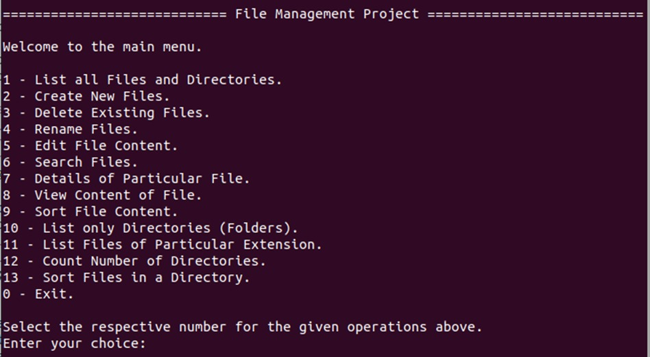

# File Management System  

## Project Description  
This File Management System provides a set of file handling operations using C and Bash scripting in the Ubuntu subsystem terminal. It allows users to manage files and directories efficiently with features such as creating, deleting, renaming, searching, and sorting.  

## Functionalities  
- List all files and directories  
- Create, delete, and rename files  
- Edit and view file content  
- Search for files  
- Sort files and directories  
- List files of a particular extension  
- Count number of directories  

## Technologies Used  
- **C Language**: Core implementation of file operations  
- **Bash Scripting**: For executing terminal-based commands  
- **Ubuntu Subsystem**: Environment for running the application  

## Screenshots

